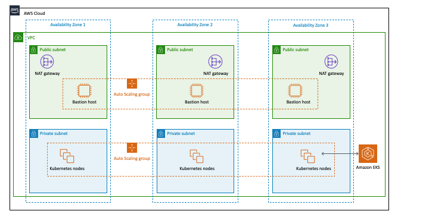

<a name="readme-top"></a>

<!-- ABOUT THE PROJECT -->
## EKS - Autoate all the tings! - About The Project

The application contained in this repo is a python Flask application that in designed to be deployed on Kubernetes. This repository contains all the required resources to get this flask api up and running on AWS EKS. This readme describes how to deploy the solution, and a brief overview of resources that were used. 


## Infrastructure 

### EKS 

For deployment of the EKS cluster, an AWS maintained ClodFormation template is used. The following architecture diagram details at a high level the infrastructure deployed by the CFN stack. 

<br />
<div align="center">
  <a href="https://github.com/github_username/repo_name">
    
  </a>
</div>
</div>


## Getting Started 

### Makefile

The makefile is used for building and deploying this application and associated infrastructure. The makefile assumes that the tools that are called from the makefile are installed and configured on the machine from where it is ran. Several tools of note are listed below.
* AWS CLI
* Docker
* Kubernetes CLI - kubectl 


### Build & Deploy

1. ex
2. ex
   ```sh
   ```
3. ex
   ```sh
    
   ```
4. ex
  

<p align="right">(<a href="#readme-top">back to top</a>)</p>


# Links & Resources  
* EKS  - https://github.com/aws-quickstart/quickstart-amazon-eks
* CFN Template - https://s3.amazonaws.com/aws-quickstart/quickstart-amazon-eks/templates/amazon-eks-entrypoint-new-vpc.template.yaml
* 3 Musketeers - https://3musketeers.io/guide/make.html


